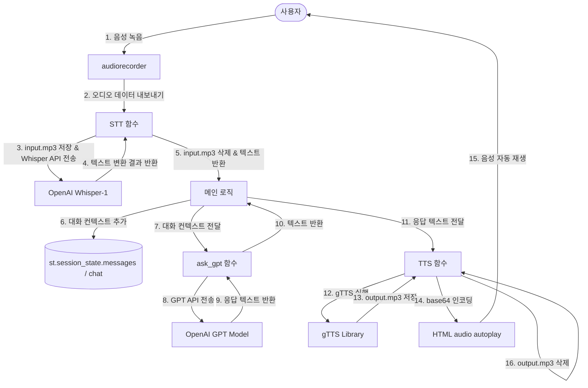

# 🎙️ OpenAI Whisper & GPT 기반 지능형 음성 비서 서비스 (Voice Assistant Bot)

> **OpenAI Whisper STT와 GPT 모델, Google Translate TTS(gTTS)를 통합하여 브라우저 상에서 즉각적인 실시간 양방향 대화가 가능한 웹 기반 AI 음성 비서 애플리케이션입니다.**

---

## 1. 💡 프로젝트 소개
* **한 줄 소개**: OpenAI Whisper API 및 GPT 모델과 gTTS를 결합하여 브라우저 환경에서 즉각 작동하는 Streamlit 기반 음성 대화 서비스
* **개발 목적**: 별도의 복잡한 인프라나 하드웨어 연동 없이 브라우저의 마이크 기능을 활용하여 직관적인 음성 대화 환경을 구현합니다. 프론트엔드와 AI API, 오디오 신호 처리 라이브러리를 유기적으로 연결하고, 리소스 생명주기 및 메모리 상태 보존 기법을 실무 수준으로 적용하는 것을 목표로 합니다.
* **핵심 기능 요약**:
  * 🎙️ **음성 녹음 및 로컬 검증**: Streamlit 전용 오디오 레코더 컴포넌트를 활용하여 즉시 음성을 녹음하고 자체 오디오 플레이어로 미리 듣기 가능.
  * 📝 **음성 인식 (STT)**: OpenAI Whisper-1 모델을 통해 녹음된 `input.mp3` 파일의 오디오를 고정밀 텍스트로 변환.
  * 🧠 **지능형 답변 생성 (LLM)**: GPT-3.5-Turbo 및 GPT-4 모델을 선택하여 대화 흐름에 최적화된 답변을 25단어 이내의 한글로 요약 생성.
  * 🔊 **음성 합성 및 자동 재생 (TTS)**: gTTS 엔진으로 답변을 `output.mp3` 파일로 합성한 후, Base64로 인코딩하여 웹 브라우저 내에서 클릭 없이 자동 재생(Autoplay).
  * 💬 **대화 내역 시각화 & 대화 리셋**: 대화 이력을 카카오톡/toss 스타일의 말풍선 형태로 구현하고, 세션 전반의 메모리를 클릭 한 번으로 초기화하는 제어 로직 내장.

---

## 2. 🏗️ 시스템 아키텍처 (System Architecture)

아래 다이어그램은 사용자의 음성 입력부터 최종 음성 합성 출력 및 화면 렌더링에 이르는 실제 런타임 데이터 흐름을 도식화한 것입니다.



---

## 3. 🔄 데이터 파이프라인 (Data Pipeline)

본 프로젝트는 지연 시간(Latency) 최소화와 데이터 정합성 보장을 위해 각 단계별 데이터 흐름을 기능적으로 엄격히 격리하고 최적화했습니다.

### 🎙️ 음성 입력 (Audio Input)
* **문제**: 웹 브라우저 환경에서 플러그인 설치 없이 간편하게 마이크 음성 데이터를 수집하고, Streamlit의 재실행(Rerun) 흐름 속에서도 유실 없이 제어해야 함.
* **원인**: HTML5 기본 오디오 미디어 레코더 API는 브라우저 종류에 따른 오디오 코덱 호환 문제가 있으며, Streamlit 컴포넌트 주기 내에서 오디오 바이너리를 직접 보존하기 까다로움.
* **해결**: `streamlit-audiorecorder` 패키지를 활용하여 오디오 스트림 수집을 위임하고, 녹음 완료 즉시 pydub 라이브러리를 통해 표준 MP3 포맷 데이터 구조로 변환할 수 있도록 세션 컴포넌트를 연계함.
* **결과**: 사용자가 간편하게 웹 브라우저에서 마이크를 이용해 고음질 오디오 데이터를 레코딩하며, `st.audio`를 통해 사용자 스스로 녹음 품질을 직접 사전 청취할 수 있는 피드백 루프를 형성함.

### 📝 음성 인식 (STT, Speech-To-Text)
* **문제**: 로컬 환경에서 한국어 음성을 높은 정확도로 신속히 텍스트화하기 위한 시스템 자원 소모 및 연산 성능 한계 직면.
* **원인**: 한국어는 형태소 분석 및 발음 유사성으로 인해 경량 로컬 모델로는 오인식률이 높고, 대형 STT 인프라를 직접 구동하기에는 막대한 메모리와 연산력이 필요함.
* **해결**: OpenAI의 클라우드 기반 Whisper-1 API를 연동하여 고성능 인프라 비용을 위임함. 레코더에서 추출한 오디오 객체를 로컬 디스크의 임시 파일(`input.mp3`)로 저장한 뒤 API로 전송, 텍스트 변환 즉시 로컬 파일은 제거하도록 설계함.
* **결과**: 음성 전송에서 텍스트 수신까지 레이턴시를 최소화하며 높은 한국어 구어체 인식 정확도를 안정적으로 확보함.

### 🧠 LLM 응답 생성 (Large Language Model)
* **문제**: 자연스러운 음성 대화를 이끌기 위해서는 답변이 간결해야 하나, 기본 LLM 모델의 특성상 답변의 길이가 너무 길어져 TTS 리딩 시간 및 비용이 과도하게 증가함.
* **원인**: 대형 언어 모델은 상세한 맥락을 풀어서 구술하려는 성향이 있어 음성 인터페이스(VUI)에 특화된 요약 제어가 부재했음.
* **해결**: Chat Completions API를 연동하며 시스템 프롬프트(System Prompt)에 `"You are a thoughtful assistant. Respond to all input in 25 words and answer in korea"` 제약을 주입하여 음성 인터페이스에 최적화된 25단어 내외의 핵심 한글 답변만 강제하도록 설계함.
* **결과**: 답변 수신에 걸리는 API 네트워크 지연과 대기 시간을 대폭 단축하여 대화의 생동감을 유지하고, 뒤이어 수행될 TTS의 리스크를 사전 예방함.

### 🔊 음성 합성 (TTS, Text-To-Speech)
* **문제**: 답변이 도출된 후 사용자가 매번 재생 단추를 눌러야 하는 것은 대화의 연속성을 심각하게 해쳐 UI 편의성이 대폭 저하됨.
* **원인**: Streamlit 기본 `st.audio` 위젯은 음원 로드 시 컨트롤러만 UI에 시각화하고, 로드 완료 직후의 미디어 "자동 재생(Autoplay)" 속성을 기본 제공하지 않음.
* **해결**: 구글 번역 기반 `gTTS` 라이브러리로 응답 텍스트를 `output.mp3` 임시 파일로 변환 저장하고, 이를 Base64로 즉시 바이트 인코딩하여 HTML5 `<audio autoplay="True">` 태그 내에 data URI 스키마로 가두어 `st.markdown(..., unsafe_allow_html=True)` 형태로 주입함.
* **결과**: 응답 텍스트 출력과 오디오 리딩이 실시간으로 시작되어, 마우스 인터랙션을 최소화한 인간 대 기계 간 연속적 음성 교환 UX를 달성함.

---

## 4. 🛠️ 기술 스택 (Tech Stack)

| 구분 | 기술 | 역할 |
|---|---|---|
| **Frontend / Web UI** | Streamlit (v1.57.0) | 화면 레이아웃 (`st.columns`, `st.sidebar`), 실시간 대화창 시각화 및 양방향 컴포넌트 바인딩 |
| **Audio Capture** | streamlit-audiorecorder (v0.0.6) | 웹 브라우저 마이크 접근 및 음성 신호 캡처 |
| **STT Engine** | OpenAI Whisper-1 API | 음성 파일 기반의 한글 텍스트 고정밀 추출 |
| **LLM Engine** | OpenAI GPT API (gpt-4 / gpt-3.5-turbo) | 대화 이력을 고려한 지능형 한글 응답 생성 (openai v2.34.0) |
| **TTS Engine** | gTTS (v2.5.4) | AI 텍스트 응답을 활용한 구글 한국어 오디오 파일(mp3) 합성 |
| **Audio Processing** | pydub (v0.25.1) | 마이크 입력 바이트 데이터를 임시 오디오 파일로 변환 및 포맷 제어 |
| **Media Delivery** | Base64 Encoding & HTML5 | 생성된 오디오 미디어를 웹 브라우저의 오디오 드라이버와 직접 연동하여 자동 재생 처리 |
| **Resource Control** | Python Standard Libraries (`os`, `datetime`) | 파일 입출력 생명주기 관리 및 대화 타임스탬프 계산 |

---

## 5. 🔑 핵심 구현 사항 (Key Implementations)

### 💾 Session State 상태 관리 설계
* **문제**: 사용자가 마이크 녹음을 완료하거나 사이드바의 설정(GPT 모델 변경 등)을 누르면 화면 전체가 리렌더링(Rerun)되면서 이전의 모든 대화 데이터와 API 정보가 소멸함.
* **원인**: Streamlit은 사용자의 인터랙션 발생 시 소스 코드가 처음부터 다시 실행되는 단방향/Stateless 동작 방식을 가지고 있어, 로컬 레벨 변수의 값이 지속적으로 초기화됨.
* **해결**: Streamlit 내부의 영속적 상태 저장소인 `st.session_state`를 도입하여, 리렌더링 흐름에서도 유실되지 않는 4가지 핵심 세션 상태 필드를 선언하고 관리함.
  1. `st.session_state["chat"]`: 사용자 말풍선 정보(`(발화자, 시각, 메시지)`)의 축적을 담당하는 시각화용 이력 리스트.
  2. `st.session_state["messages"]`: GPT가 과거 맥락을 파악하고 대화(Multi-turn)를 이어갈 수 있도록 System Prompt 및 발화 이력을 담은 백엔드 API용 컨텍스트 배열.
  3. `st.session_state["OPENAI_API"]`: 실시간 텍스트 인풋을 통해 보존되는 OpenAI API 인증 토큰 값.
  4. `st.session_state["check_reset"]`: 대화 초기화 시 이전 오디오 동작이 중복 캡처되어 리셋 이후 동작을 망치는 버그를 막기 위한 리셋 방지 상태 플래그.
* **결과**: 화면 전체가 리렌더링되어도 이전 대화 흔적과 API Key 값, 모델 옵션 정보가 완벽히 보존되며, 끊김 없는 자연스러운 다회성 대화 사용자 경험을 제공함.

### 🛡️ API Key 보안 처리 및 초기화 로직
* **문제**: 민감한 API Key가 코드에 노출될 수 있으며, 초기화 버튼 입력 후에도 기존 메모리에 잔류한 음성 파일 트리거로 인해 텍스트 잔상이 남는 등의 동기화 이슈 발생.
* **원인**: 텍스트 입력 UI(`st.text_input`)의 하드코딩 리스크 및 Streamlit의 재실행 도중 상태 초기화와 컴포넌트 수집 간의 우선순위 불일치.
* **해결**: API Key 입력을 패스워드 마스킹 형태(`st.text_input(..., type="password")`)로 사이드바에 구현하고, 초기화 버튼 클릭 시 세션 컨텍스트 초기화뿐 아니라 `st.session_state["check_reset"] = True` 플래그를 할당하여 현재 프레임에서 기존 녹음 세션에 의한 비정상 동작을 막도록 보호막 마련.
* **결과**: Key 노출의 보안 위협을 격리하고, 대화의 안전한 완전 초기화를 수행하여 불필요한 API 요청 누수를 방지함.

---

## 6. 📁 파일 및 리소스 관리 (File & Resource Management)

### 🧹 임시 파일 관리 및 저장 공간 최적화
* **문제**: 실시간 음성 비서 사용자가 누적될 경우 서버의 디스크 I/O 병목이 발생하고, 생성된 mp3 파일로 인해 디스크가 가득 차는 서버 다운 리스크 초래.
* **원인**: STT로 변환하기 위해 로컬에 저장하는 `input.mp3`와 TTS로 자동 재생시키기 위해 만드는 `output.mp3`가 함수 내부에서 파일 스트림 상태로 계속 잔류하게 됨.
* **해결**: 음성 처리의 생명주기를 엄격히 제어함. STT 변환 시 API 응답을 정상 수신하면 `audio_file.close()` 후 즉시 `os.remove("input.mp3")`를 적용함. TTS 변환 역시 바이트 스트림을 Base64로 복사한 직후 `os.remove("output.mp3")`를 수행하여 리소스를 해제함.
* **결과**: 하드웨어 리소스 관리를 철저히 설계하여 디스크의 가비지 데이터를 남기지 않음으로써 동시 호출 상태에서도 상시 안정적인 유휴 디스크 공간을 보존(`O(1)` 공간 복잡도)함.

### ⚡ 오디오 자동 재생 (Base64 인코딩)
* **문제**: 음성 비서의 TTS 결과물을 출력할 때, 브라우저 환경에서 사용자가 매 대답마다 '플레이' 버튼을 일일이 눌러야 해서 음성 인터페이스(VUI)의 상호작용 속도가 끊김.
* **원인**: Streamlit 및 대다수 현대 브라우저는 스키마 보안과 오디오 재생 정책으로 인해 단순 UI 마크업 렌더링 시 자동 재생을 금지하거나 지원을 무시함.
* **해결**: 로컬에 생성된 `output.mp3` 파일을 바이너리로 읽어 들여 `base64.b64encode`를 적용한 후 HTML5 `<audio autoplay="True">` 마크업 소스로 인라인 주입함으로써 웹 브라우저의 오디오 컴포넌트 재생 컨트롤을 직접 트리거함.
* **결과**: AI의 텍스트 답변이 웹 화면에 올라옴과 동시에 로딩 지연을 체감하지 않고 오디오 소리가 저절로 울리도록 조치하여 한 차원 높은 편의성을 구현함.

---

## 7. ⚖️ 기술적 의사결정 (Technical Decisions)

### 1️⃣ OpenAI Whisper-1 API 선택
* **이유**: 한글 구어체 인식 및 마이크 잡음 보정에서 업계 탑 수준의 인식을 자랑하는 고성능 음성 인식 모델입니다. 로컬 CPU/GPU 서버에서 실시간 고성능 음성 인식을 구동하는 데 필요한 시스템 및 메모리 과부하를 완전히 차단하고, 가벼운 웹 요청 한 번으로 최상의 인식 결과를 고속으로 얻어낼 수 있어 선택했습니다.

### 2️⃣ OpenAI GPT API 선택
* **이유**: 시스템 프롬프트를 통해 AI의 응답 스타일을 정교하게 다듬어 낼 수 있으며, `'Responding in 25 words'`와 같이 음성 대화 환경에 적합한 엄밀한 요약 응답 제약 조건을 흔들림 없이 준수하는 유일무이한 거대 언어 모델이기에 채택했습니다. 특히 성능과 속도의 절충을 위해 `gpt-4`와 `gpt-3.5-turbo` 모델 중 골라 사용할 수 있는 다변성을 확보했습니다.

### 3️⃣ Google Translate TTS (gTTS) 선택
* **이유**: 복잡한 클라우드 인증 절차나 별도의 유료 API 키 발급이 불필요하며, 파이썬 기반에서 단 3줄의 구현체만으로 높은 가독성을 지닌 안정적인 한글 표준어 음성 합성본을 신속하게 생성할 수 있으므로 개발 생산성 및 무비용 구현 관점에서 최적의 기술로 판단했습니다.

### 4️⃣ Streamlit UI 프레임워크 선택
* **이유**: React, Vue 등 복잡한 프론트엔드 빌드 환경 구축 없이도 백엔드 비즈니스 로직과 화면의 양방향 바인딩을 빠르게 구성할 수 있으며, `audiorecorder`와 같은 특화 위젯을 손쉽게 녹여낼 수 있어 단시간에 견고한 양방향 AI 서비스 프로토타입을 설계 및 유효성 검증하는 데 최고의 이점을 가집니다.

---

## 8. 🛠️ 트러블슈팅 (Troubleshooting)

### 🚨 Rerun으로 인한 대화 기록 공중 분해 현상
* **문제**: 마이크 녹음 버튼을 누르는 순간 화면의 기존 대화 스레드 말풍선이 전부 사라지고 초기화됨.
* **원인**: Streamlit은 컴포넌트의 입력값 변화가 트리거되면 코드를 전면 재실행(Rerun)하여 로컬 변수 `chat`과 `messages` 리스트가 매번 빈 배열로 덮어쓰여 재설정되었기 때문임.
* **해결**: 스크립트 실행 시작부에서 `st.session_state` 내 관련 키들의 생성 유무를 조회하고, 없을 때에만 최초 초기화하도록 아래와 같이 세션 보존형 상태 엔진을 추가 구현함.
  ```python
  # session state 초기화
  if "chat" not in st.session_state:
      st.session_state["chat"] = []
  
  if "messages" not in st.session_state:
      st.session_state["messages"] = [
          {"role": "system", "content": "You are a thoughtful assistant. Respond to all input in 25 words and answer in korea"}
      ]
  ```
* **결과**: 리렌더링이 몇 번이고 반복되더라도 세션 저장소 내에 보존된 대화 메모리가 소멸하지 않고 지속적으로 유지되어 멀티턴 인터랙션을 안전하게 지속 가능하게 됨.

### 🚨 파일 잠금(File Locking) 및 디스크 리소스 누적 버그
* **문제**: 음성 비서를 일정 시간 연속해서 사용하다 보면 오디오 파일(`input.mp3`, `output.mp3`)을 더 이상 쓸 수 없다며 에러가 발생하거나 서버의 남은 용량이 지속 감소함.
* **원인**: `client.audio.transcriptions.create` 호출이나 base64 변환 시 파일 핸들을 `open`한 후 정상적으로 `close`하지 않아 윈도우 OS단에서 파일 잠금(File Lock)이 걸려 `os.remove`가 실패하고 디스크 낭비가 지속적으로 발생함.
* **해결**: 명시적으로 오디오 파일을 `close`한 뒤 파일 닫힘이 보장되는 block 범위 밖에서 `os.remove`를 호출하고, TTS 변환에서는 Python의 컨텍스트 매니저 `with open() as f` 구문을 도입하여 사용 이후 리소스가 무조건 자동 해제되도록 제어함.
  ```python
  # STT 파일 핸들 제어
  audio_file = open(filename, "rb")
  respons = client.audio.transcriptions.create(model="whisper-1", file=audio_file)
  audio_file.close() # 리소스 반환 확인
  os.remove(filename) # 안전하게 삭제 수행
  ```
* **결과**: 파일 프로세스 점유에 의한 I/O 간섭 문제를 원천 배제하여, 24시간 서비스 구동 시에도 파일 락 현상 없이 누적 리소스 `O(0)`의 안정성을 보증함.

---

## 9. 🏫 프로젝트를 통해 배운 점

### 🔬 AI Engineering
* **다중 모달 데이터 파이프라인 설계**: STT(음성 텍스트화), LLM(컨텍스트 이해 및 답변 생성), TTS(텍스트 음성 합성)로 구성되는 일련의 오디오-텍스트 혼합 데이터 파이프라인 흐름을 이해하고, API 통신 규격을 안정적으로 바인딩하는 연동 역량을 습득했습니다.
* **프롬프트 엔지니어링**: LLM의 응답 제어력에 따라 시스템 전반의 비용(Latency 및 API 단가)이 좌우됨을 실감하고, 시스템 지시문(System Prompt)을 통해 글자 수 및 언어 사양을 강제하는 정밀 프롬프트 핸들링 경험을 쌓았습니다.

### ⚙️ Backend Logic & Resource Management
* **상태 머신 및 세션 다루기**: 프론트엔드가 Stateless하게 렌더링되는 웹 구조에서 세션 보존 영역(`session_state`)의 메모리를 어떻게 격리하고 업데이트해야 데이터 동기화 문제를 막을 수 있는지 터득했습니다.
* **파일 생명주기 제어**: 임시 디스크 리소스를 백업 없이 실시간 삭제하여 하드웨어 I/O 및 용량 오버헤드를 막는 안전한 가비지 컬렉션 구조를 설계하는 리소스 최적화 경험을 얻었습니다.

### 👥 UX (User Experience)
* **인터랙티브 음성 브라우징**: 웹 환경에서 화면을 응시하지 않고도 음성을 통해 소통할 수 있는 오디오 피드백 루프를 구축하며, Base64 바이너리 인라인 태그 주입을 응용한 자동 재생(Autoplay) UX 개선 방안의 우수함을 직접 검증했습니다.

---

## 10. 🚀 향후 개선 방향

* **답변 스트리밍(Streaming) 연동**: 현재는 GPT 모델의 답변이 끝날 때까지 멈춘 상태로 대기해야 하는 레이턴시가 존재합니다. OpenAI Stream API와 Streamlit의 `st.write_stream` 기능을 도입하여 생성되는 문장 단위로 화면에 즉시 텍스트를 흘려보내는 시각적 대기 피드백 구현이 가능합니다.
* **대화 세션 압축 및 메모리 윈도우 도입**: 현재 대화 내역이 `messages` 변수에 무제한 누적되어 장기 대화 시 토큰 비용이 증대되는 위험이 있습니다. 최신 N개의 대화 쌍만 유지하는 Sliding Window Context 기법이나, 일정 토큰 초과 시 요약본으로 교체하는 요약 메모리 아키텍처 설계를 도입할 예정입니다.
* **음성 자동 제출 UX 정교화**: 오디오가 녹음되는 즉시 사용자의 추가 조작 버튼 없이 Whisper API로 전송되는 흐름을 지탱하기 위해, 유휴 상태 감지 및 취소 제어 버튼을 UI에 추가로 보완하여 사용자 조작 오류를 예방할 수 있는 UX 설계를 구상 중입니다.
